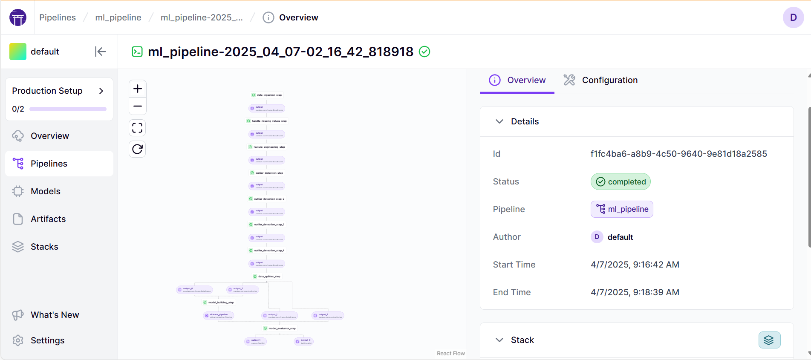
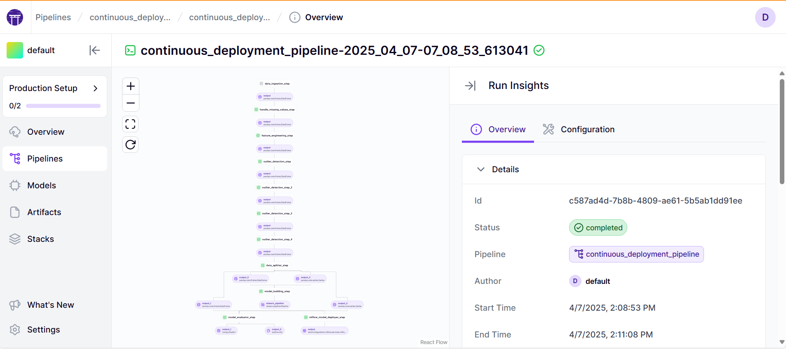
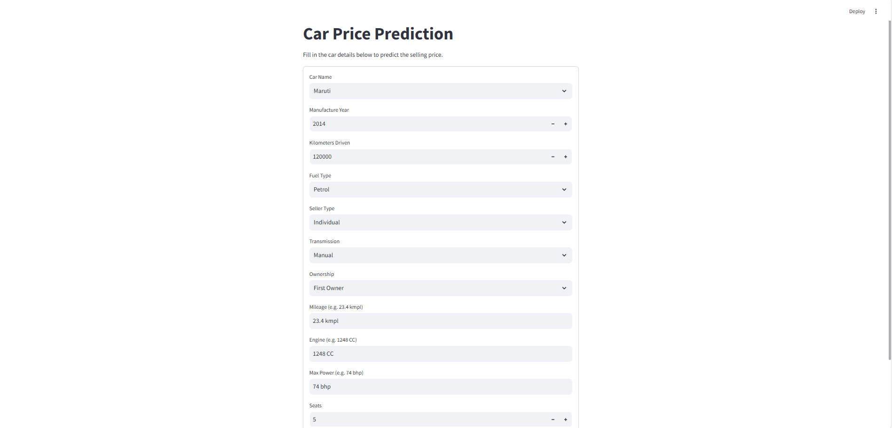

## 🏁 Project Overview

Welcome to the **Used Car Price Prediction MLOps Project**! This end-to-end machine learning solution is designed to predict the selling price of used cars based on various vehicle features such as mileage, engine power, ownership type, fuel type, and more.

By leveraging modern MLOps tools like **ZenML**, **MLflow**, and **Streamlit**, the project offers a modular, scalable, and reproducible pipeline to automate everything from data ingestion and preprocessing to model training, deployment, and inference.

This project is built to guide you seamlessly through the complete ML workflow — featuring robust data cleaning, feature engineering, model evaluation, and continuous deployment strategies. It also ensures efficient model monitoring and version control via MLflow integration.

Ultimately, this solution empowers businesses, resellers, or platforms to estimate car values accurately, enhancing decision-making, improving user trust, and optimizing pricing strategies.

## 🎯 Objective

The primary objective of this project is to build a machine learning model that accurately predicts the **selling price of used cars** based on various vehicle attributes and specifications.

Key input features used in the prediction include:

- **Vehicle information**: year of manufacture, kilometers driven, mileage, engine capacity, max power.
- **Categorical details**: fuel type, transmission type, ownership history, seller type.
- **Additional specifications**: number of seats, brand name.

Data Source: The dataset for this project was sourced from https://www.kaggle.com/datasets/nehalbirla/vehicle-dataset-from-cardekho


## ⚙ Pipelines

This project leverages three modular and automated pipelines to streamline the machine learning lifecycle—from raw data ingestion to real-time inference. Built using **ZenML**, these pipelines ensure reproducibility, scalability, and robust tracking with **MLflow** integration.

Each pipeline is responsible for a specific stage in the MLOps workflow:

### 1. `ml_pipeline` 🚂

Responsible for end-to-end model training and evaluation. The steps include:

- **Data Ingestion**: Loads and extracts the dataset from its source.
- **Data Cleaning**: Handles missing values, performs type conversion, and basic validation, remove duplication.
- **Feature Engineering**: Transforms input features (e.g., encoding, log-scaling).
- **Outlier Removal**: Identifies and removes anomalies to ensure data quality.
- **Data Splitting**: Splits the cleaned dataset into train/test sets.
- **Model Training**: Trains a regression model using the prepared data.
- **Model Evaluation**: Computes performance metrics and logs them to MLflow.



### 2. `continuous_deployment_pipeline` 🚀

This pipeline continuously monitors and deploys the best-performing model:

- **Model Deployer**: Automatically deploys the trained model using MLflow.
- **Model Tracker**: Logs the deployed model’s metadata for versioning and reproducibility.

It ensures that the most accurate and up-to-date model is available in production.


### 3. `inference_pipeline` 🧠

Used for generating predictions with new data:

- **Dynamic Importer**: Loads test or user-provided input data.
- **Model Loader**: Fetches the deployed model service.
- **Predictor**: Sends the data to the deployed MLflow model and returns predictions.

These pipelines are designed to work both independently and as part of a larger CI/CD MLOps workflow.


## 🛠️ Tech Stacks

This project leverages a modern MLOps toolset to automate and streamline the entire machine learning workflow — from experimentation to deployment and user interaction.

### 👉 Experiment Tracking

**MLflow**  
- Tracks experiments, metrics, and parameters.  
- Manages model versioning and lifecycle.  
- Provides a user interface to visualize runs and compare results.  
- Handles model deployment for online prediction services.

### 👉 CI/CD Pipelines

**ZenML**  
- Provides a robust MLOps pipeline framework for automating ML workflows.  
- Simplifies experiment reproducibility, caching, and step orchestration.  
- Enables seamless integration with MLflow for deployment and tracking.  
- Supports continuous training and deployment pipelines.

### 👉 User Interaction

**Streamlit**  
- Offers a lightweight, interactive web application for users to input car features.  
- Sends user inputs to the deployed model endpoint and displays the predicted selling price in real time.  
- Allows non-technical users (e.g., business teams) to engage with ML predictions through a simple UI.


 

## Local Setup 👨🏼‍💻
1. **Clone the Repository**:
```bash
git clone https://github.com/nhanho2508/car-prices-predictor-system-zenml-mlflow.git
cd car-prices-predictor-system-zenml-mlflow
```

2. **Set Up a Virtual Environment**:
```bash
# For macOS and Linux:
python3 -m venv venv

# For Windows:
python -m venv venv
```

3. **Activate the Virtual Environment**:
```bash
# For macOS and Linux:
source venv/bin/activate

# For Windows:
.\venv\Scripts\activate
```

4. **Install Required Dependencies**:
```bash
pip install -r requirements.txt
```

## Zenml Integration ⛩️
1. Install ZenML - https://docs.zenml.io/getting-started/installation 
```bash
pip install zenml["server"]
zenml init   
```

2. Mlflow integration:
```bash
zenml integration install mlflow -y
```

3. Register mlflow in the stack:
```bash   
zenml experiment-tracker register mlflow_tracker --flavor=mlflow
zenml experiment-tracker register mlflow_tracker --flavor=mlflow
zenml model-deployer register mlflow_deployer --flavor=mlflow
zenml stack register my_stack \
  --orchestrator=default \
  --artifact-store=default \
  --model_deployer=mlflow_deployer \
  --experiment_tracker=mlflow_tracker \
  --set# if not already set
```


# Running the Project 🏃

Follow these steps to run different components of the project:

1. **Training Pipeline**: 
   - To initiate the training pipeline, execute 

   ```bash
    python3 run_pipeline.py
    ```
2. **Continuous Integration Pipeline**:
   - To execute the CI/CD pipeline for continuous integration, run

   ```bash
   python3 run_deployment.py
   ```

3. **Streamlit Application**:
   - Start the Streamlit app to access the prediction interface using
   
    ```bash
   streamlit run app.py
   ```  
 